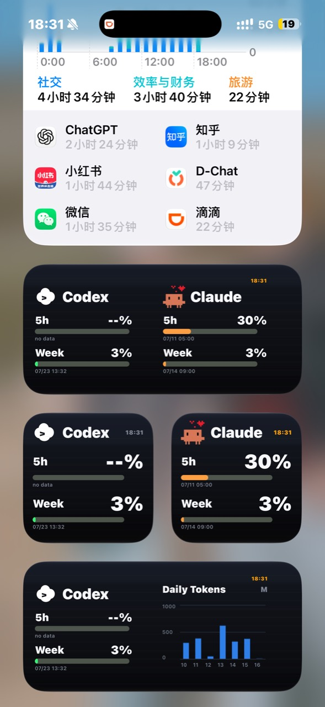
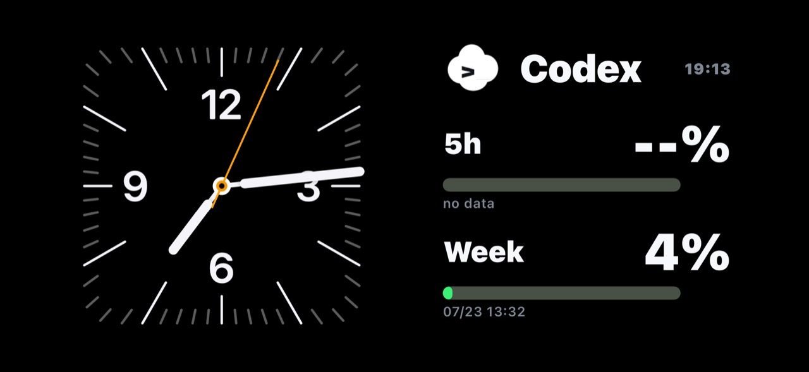

# Scriptable Codex / Claude 用量小组件

这是 Codex / Claude 用量小组件的公开发布仓库，只包含 Scriptable 前端和 `/usage` API 契约，不包含采集后端、账号凭据或部署配置。

## 效果展示

<p align="center">
  
</p>
<p align="center"><sub>Codex / Claude 单服务、双服务与周用量图表</sub></p>

<p align="center">
  
</p>
<p align="center"><sub>Codex 用量横屏效果</sub></p>

## 下载

从 [Latest Release](https://github.com/MananaFX/Scritable-Codex-Usage/releases/latest) 只需下载：

- `Codex-Usage.js`：Codex / Claude 组合小组件。

下载后在 iPhone 上使用 **Scriptable App** 打开 `Codex-Usage.js`。打开源码，将顶部的 `DEFAULT_SERVER` 替换为你自己的 HTTPS 用量 API，然后保存并添加小组件即可。

同一个 `Codex-Usage.js` 已支持全部显示模式：

- 小组件参数 `codex`：只显示 Codex。
- 小组件参数 `claude`：只显示 Claude。
- 中组件参数 `both`：同时显示 Codex 和 Claude。
- 中组件参数 `week`：显示 Codex 和周用量图表。

## 更换 API 链接

使用 Scriptable 打开下载的脚本，将顶部占位地址替换为你自己的 HTTPS API：

```js
const DEFAULT_SERVER = "https://example.com/usage"
```

- 推荐使用组合接口 `/usage`，由同一个小组件按参数选择展示内容。
- 也可以通过 Scriptable 小组件参数临时传入 API 地址。

## API 格式

组合接口使用 `services.codex` 和 `services.claude`。额度窗口使用 `five_hour`、`weekly`、`used_percent`、`resets_at`、`resets_at_iso` 和 `remaining_seconds` 等字段。

完整定义见 [`docs/usage-api-schema.json`](docs/usage-api-schema.json)。

## 发布新版本

仓库中的 GitHub Action 支持两种方式：

- 推送 `v*` 标签，例如 `v0.3.0`；
- 在 Actions 页面手动运行 `Release Codex Usage Widget`，输入版本标签。

Action 会先检查 JavaScript 和 JSON，再创建只包含 `Codex-Usage.js` 的 GitHub Release。

本项目只提供展示端代码和接口契约，不提供账号数据、Cookie、Token、API Key，也不提供绕过官方访问或订阅限制的方法。请只接入你有权使用的数据源。
